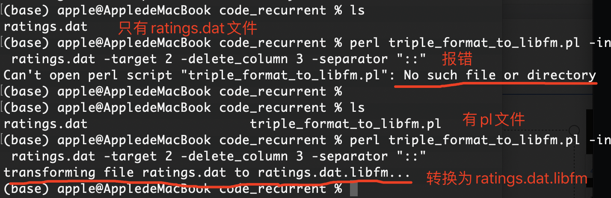

Action1项目要求：使用libfm工具对movielens进行评分预测，采用SGD优化算法

# 1 安装LibFM:

1. 下载源码：http://www.libfm.org/

   点击"**[libfm-1.42.src.tar.gz](http://www.libfm.org/libfm-1.42.src.tar.gz)**"下载

2. 解压文件，在终端进入解压后的路径

   ```cd libfm-1.42.src```

   

3. 再在终端运行：

   ```make all```

# 2 文件格式转换

1. 进入ratings.dat所在文件夹路径code_recurrent，使用libfm自带的pl文件把dat文件转为ratings.dat.libfm文件，命令如下：

   ```perl
   perl triple_format_to_libfm.pl -in ratings.dat -target 2 -delete_column 3 -separator "::"
   ```

   使用此命令时，triple_format_to_libfm.pl也必须放在该路径下，否则会报错：

   ```perl
   Can't open perl script "triple_format_to_libfm.pl": No such file or directory
   ```

   

# 3 使用libFM训练FM模型

终端 cd 进入code_recurrent文件夹，输入以下命令：

```
/Users/apple/Desktop/libfm-1.42.src/bin/libFM -task r -train ratings.dat.libfm -test ratings.dat.libfm -dim '1,1,8' -method sgd -learn_rate 0.1 -regular '0,0,0.01' -init_stdev 0.1 -out out_result.txt
```

训练集和测试集都为ratings.dat.libfm，使用偏差、单向交互作用和成对交互作用k= 8的因子分解的回归任务的FM，优化方法用SGD，学习率0.1，正则化系数分别为r0=0, r1=0, r2=0.1，默认循环次数100次。运行过程如下：

```
(base) apple@AppledeMacBook code_recurrent % /Users/apple/Desktop/libfm-1.42.src/bin/libFM -task r -train ratings.dat.libfm -test ratings.dat.libfm -dim '1,1,8' -method sgd -learn_rate 0.1 -regular '0,0,0.01' -init_stdev 0.1 -out out_result.txt

----------------------------------------------------------------------------
libFM
  Version: 1.4.2
  Author:  Steffen Rendle, srendle@libfm.org
  WWW:     http://www.libfm.org/
This program comes with ABSOLUTELY NO WARRANTY; for details see license.txt.
This is free software, and you are welcome to redistribute it under certain
conditions; for details see license.txt.
----------------------------------------------------------------------------
Loading train...	
has x = 1
has xt = 0
num_rows=1000209	num_values=2000418	num_features=9746	min_target=1	max_target=5
Loading test... 	
has x = 1
has xt = 0
num_rows=1000209	num_values=2000418	num_features=9746	min_target=1	max_target=5
#relations: 0
Loading meta data...	
learnrate=0.1
learnrates=0.1,0.1,0.1
#iterations=100
SGD: DON'T FORGET TO SHUFFLE THE ROWS IN TRAINING DATA TO GET THE BEST RESULTS.
#Iter=  0	Train=0.943536	Test=0.943536
#Iter=  1	Train=0.936752	Test=0.936752
#Iter=  2	Train=0.940344	Test=0.940344
…………
#Iter= 98	Train=0.938708	Test=0.938708
#Iter= 99	Train=0.938956	Test=0.938956
Final	Train=0.938956	Test=0.938956
(base) apple@AppledeMacBook code_recurrent % 
```

输出结果[out_result.txt](./out_result.txt)


# 4 拆分数据集后重新训练

1. 将数据集按照75%训练集、25%测试集进行拆分，拆分数据集的代码文件：[HX04_Lesson04_Action1_split_ratings_dataset.ipynb](./HX04_Lesson04_Action1_split_ratings_dataset.ipynb)

   利用该代码进行拆分时，一定在保存到本地前打乱数据集。一开始未打乱数据集，导致模型训练时，测试集loss从不下降，一直升高。

2. 使用perl命令将训练集和测试集转为libfm格式

   训练集ratings_train.csv转为ratings_train.csv.libfm

   ```perl
   perl triple_format_to_libfm.pl -in ratings_train.csv -target 2 -delete_column 3 -separator ","
   ```

   将测试集ratings_test.csv转为ratings_test.csv.libfm

   ```perl
   perl triple_format_to_libfm.pl -in ratings_test.csv -target 2 -delete_column 3 -separator ","
   ```

   

3. 使用LibFM重新训练

   得到的最佳模型命令如下：

   ```
   /Users/apple/Desktop/libfm-1.42.src/bin/libFM -task r -train ratings_train.csv.libfm -test ratings_test.csv.libfm -dim "1,1,15" -method sgd -learn_rate 0.0001 -regular "5,5,0.1" -init_stdev 0.1 -iter 500 -out out_rating_preds.txt
   ```

   以下为模型参数推导过程记录：

   当正则化系数都设为0.01的时候，由于惩罚过小，反而导致loss越来越大。

   下表中 -dim 使用默认值"1,1,8"：

   | 序号 | learn_rate |   regular | iter | 训练集 |  loss | 测试集 |   loss |                                结果 |
   | ---: | ---------: | --------: | ---: | ------ | ----: | -----: | -----: | ----------------------------------: |
   |      |         值 |        值 |   值 | 初始   |  最终 |   初始 |   最终 |                            loss对比 |
   |    1 |        0.1 |   0,0,0.1 |  100 | 0.944  | 0.894 |  1.361 |  1.382 |         Train下降，Test上升，过拟合 |
   |    2 |       0.01 |      同上 | 同上 | 0.922  | 0.825 |  1.246 |  1.361 |         Train下降，Test上升，过拟合 |
   |    3 |       同上 | 10,10,0.1 |   10 | 1.260  | 0.897 |  2.003 |  1.336 |                      均下降，欠拟合 |
   |    4 |      0.001 | 10,10,0.1 | 同上 | 2.813  | 1.270 |  2.814 |  2.022 |                      均下降，欠拟合 |
   |    5 |       同上 |      同上 |  100 | 2.813  | 0.879 |  2.814 |  1.327 |                    loss下降接近平缓 |
   |    6 |       同上 |   10,10,1 | 同上 | 2.813  | 1.356 |  2.814 |  1.612 |                    loss下降接近平缓 |
   |    7 |       同上 |   20,20,1 | 同上 | 2.813  | 1.353 |  2.814 |  1.613 |                 前7次迭代loss没变化 |
   |    8 |       同上 |   20,20,5 | 同上 | 2.813  | 2.813 |  2.814 |  2.814 |                        loss均没变化 |
   |    9 |       同上 |   20,15,1 | 同上 | 2.813  | 1.354 |  2.814 |  1.612 |                 前7次迭代loss没变化 |
   |   10 |       同上 |   15,15,1 | 同上 | 2.813  | 1.354 |  2.814 |  1.613 |             前7次loss没变化，欠拟合 |
   |   11 |       0.01 |      同上 | 同上 | 2.796  | 1.366 |  2.810 |  1.613 |                50次前loss几乎不变了 |
   |   12 |     0.0001 |   10,10,1 | 同上 | 2.813  | 1.241 |  2.814 |  1.989 |     均在下降，欠拟合,未留意初始变化 |
   |   13 |       同上 | 10,10,0.1 |  200 | 2.813  | 0.959 |  2.814 |  1.542 |                前28次迭代loss没变化 |
   |   14 |       同上 | 20,20,0.1 |  100 | 2.813  | 1.253 |  2.814 |  2.022 |                前41次迭代loss没变化 |
   |   15 |       同上 |   15,15,1 | 同上 | 2.813  | 2.632 |  2.814 |  2.764 |                前82次迭代loss没变化 |
   |   16 |       同上 | 15,15,0.1 | 同上 | 2.813  | 1.223 |  2.814 |  1.983 |                前35次迭代loss没变化 |
   |   17 |       同上 |   10,10,1 |  500 | 2.813  | 1.359 |  2.814 |  1.638 |              前66次loss没变化，在降 |
   |   18 |       同上 |   5,5,0.1 | 同上 | 2.813  | 0.905 |  2.814 |  1.344 |                    均在下降，欠拟合 |
   |   19 |       同上 |     5,5,1 | 同上 | 2.812  | 1.363 |  2.814 | 1.6412 |                仍在下降，但下降较慢 |
   |   20 |       同上 |  5,5,0.01 |  100 | 2.812  | 1.227 |  2.814 |  1.974 |                  仍均在下降，欠拟合 |
   |   21 |       同上 |      同上 |  500 | 2.812  | 0.880 |  2.814 |  1.479 |                  仍均在下降，欠拟合 |
   |   22 |      0.001 |   5,5,0.1 |  100 | 2.619  | 0.882 |  2.737 |  1.326 |                test开始增加，过拟合 |
   |   23 |       同上 |  5,5,0.01 |  100 | 2.619  | 0.824 |  2.737 |  1.425 |                    均在下降，欠拟合 |
   |   24 |       同上 |      同上 |  500 | 2.619  | 0.782 |  2.737 |  1.401 | 记录的是在236次迭代测试集最低的loss |

   经过多次尝试，发现：

   + 当学习率在0.1时，几乎刚开始就过拟合了(序号1)；

   + 当学习率在0.01时，即使调整了正则化系数，但训练不到50次也会过拟合(序号11)；

   + 当学习率在0.001时，偏置项w0和一阶项w1的的正则系数大于1；而二阶项v的正则系数大于1的时候，效果会变差；所以复杂的项，惩罚系数就小一些；简单的项，惩罚系数需要大一些；

   + 当学习率0.0001时，根据序号18模型的表现，我在序号18模型基础上，调整了-dim参数值，得到以下结果:

     | dim    | Iter | 训练集 | loss  | 测试集 | loss  | 结果             |
     | ------ | ---- | ------ | ----- | ------ | ----- | ---------------- |
     | 值     | 值   | 初始   | 最终  | 初始   | 最终  | loss对比         |
     | 1,1,10 | 500  | 2.812  | 0.909 | 2.814  | 1.345 | 均在下降，欠拟合 |
     | 1,1,15 | 同上 | 2.812  | 0.901 | 2.814  | 1.344 | 均在下降，欠拟合 |

   + 发现调整dim参数后，loss又下降了，只是比较慢，所以尝试了序号22~24，得到序号24的模型。在序号24模型的基础上，再调整dim参数：

     | dim    | Iter | 训练集 | loss  | 测试集 | loss  | 结果                            |
     | ------ | ---- | ------ | ----- | ------ | ----- | ------------------------------- |
     | 值     | 值   | 初始   | 最终  | 初始   | 最终  | loss对比                        |
     | 1,1,10 | 200  | 2.619  | 0.774 | 2.737  | 1.406 | 均在下降，但趋于平缓            |
     | 1,1,15 | 同上 | 2.618  | 0.735 | 2.736  | 1.415 | 记录的是第218次测试集最低的loss |

     根据上下2表的比较，所有结果里，泛化能力最好的模型命令如下：

     ```
     /Users/apple/Desktop/libfm-1.42.src/bin/libFM -task r -train ratings_train.csv.libfm -test ratings_test.csv.libfm -dim "1,1,15" -method sgd -learn_rate 0.0001 -regular "5,5,0.1" -init_stdev 0.1 -iter 500 -out out_rating_preds.txt
     ```

     

   + 找到的train loss和test loss结果分析的参考思路：

     + train loss 不断下降，test loss不断下降，说明网络仍在学习;
     + train loss 不断下降，test loss趋于不变，说明网络过拟合;

     + train loss 趋于不变，test loss不断下降，说明数据集100%有问题;

     + train loss 趋于不变，test loss趋于不变，说明学习遇到瓶颈，需要减小学习率或批量数目;

     + train loss 不断上升，test loss不断上升，说明网络结构设计不当，训练超参数设置不当，数据集经过清洗等问题。

# 5 总结：

1. 在进行文件格式转换时，需要将triple_format_to_libfm.pl放入待转换文件同一路径下。
2. 使用libFM命令时，需要在终端终端libfm可执行文件的路径`/Users/apple/Desktop/libfm-1.42.src/bin/libFM`，否则会报zsh无法识别该命令。
3. 为-regular 传参时，单个数字可以直接传，如果是3个数字，则需要用引号括起来: `-regular "0,0,0.01"` ;
4. 为-dim 传参时，3个数字也需要用引号括起来；
5. 为-method传参时，优化方法的名称必须小写，如果是大写，会报错`ERROR: unknown method`;
6. 优化方法使用SGD时，必须指定-learn_rate学习率， -regular 正则化系数、 -init_stdev 初始化参数V的正态分布的标准偏差；
7. 本次训练迭代次数使用了默认值，如果需要训练1000次，需要通过`-iter 1000`进行指定。
8. 没有找到libFM拆分数据集的方法，所以我使用了sklearn来分层拆分数据集。
9. 原本对回归模型的参数调整有疑惑，这次在不停尝试中有了一些体会。可以借鉴ALS的思路，固定几个参数的值，调整其他参数，并记录下调整前后loss的变化，以此作为衡量模型好坏的依据。利用这种方法，最终找到了前面一节中相对好的模型。